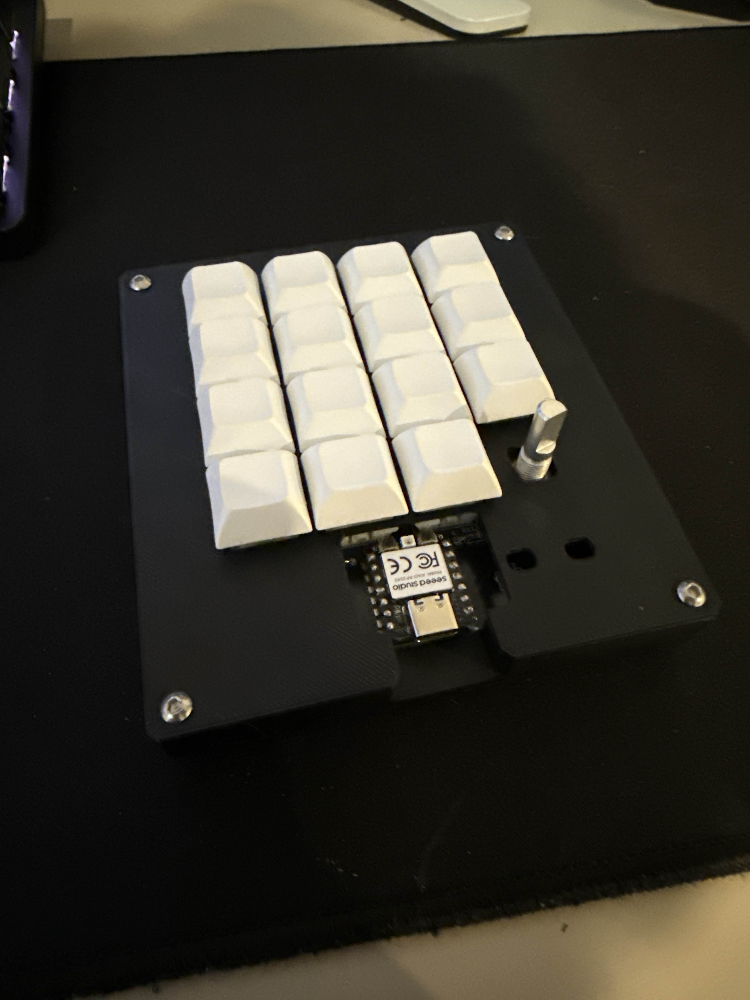

# Rudra's Hack Pad!

This is a custom hackpad made and designed by me featuring 15 keys and one rotary encoder with 2 led lights. 

---

##  Screenshots
###Final hackpad

### Overall Hackpad

### Schematic

### PCB Layout

### Case & Assembly

---

##  Bill of Materials (BOM)

- 1x XIAO RP2040 controller
- 15x Mx-switches
- 16x 1N4148 diodes
- 1x Rotary encoder with switch
- 2x SK6812MINI RGB LED
- 1x Pcb
- 1X 3d printed case
- 4x Screws + standoffs for case assembly

---

##  Firmware
- Written in [KMK Firmware](https://github.com/rudra26161/Blueprint---Hackpad/blob/c94d1e2d607d7ab2b1c8bd9e36697b46c6f0982a/Firmware/kmk%20Hackpad)

## Other
pray for me that this works
